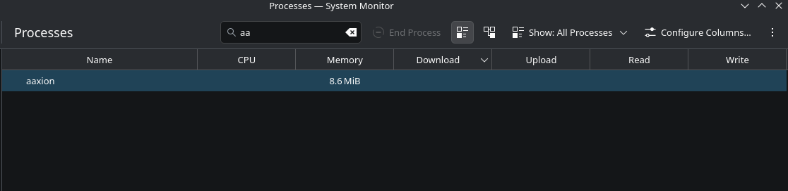
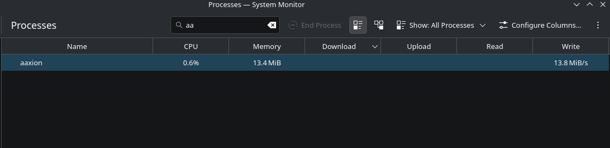

[](https://wakatime.com/badge/user/c8cd0c53-219b-4950-8025-0e666e97e8c8/project/2c075b02-2f11-41db-bb23-9ba69ced2e40)

# ⚡️ Aaxion

**Aaxion** is a lightweight, high-performance file server designed to repurpose old hardware into efficient storage nodes. I built this to utilize my old laptop's 1TB storage as a dedicated file cloud for my main devices.

---

## 🚀 Key Features

- **Zero-Buffer Streaming:** Uploads and downloads are streamed directly to disk/network. A 10GB file transfer uses only ~32KB of RAM.
- **Chunked Uploads:** Supports chunked uploading to bypass network limits (e.g., Cloudflare Tunnel).
- **Temporary Sharing:** Generate one-time secure links for external file sharing.
- **Cross-Platform:** Written in Go, runs on Linux (primary) and Windows.

---

## 📥 Installation

### Option 1: Binary Installation

1.  **Download:** Check the [latest release](https://github.com/codershubinc/aaxion/releases) and get the binary for your OS.
2.  **Permissions:**
    - **Linux:** `chmod +x aaxion-linux-amd64`
    - **Windows:** No action needed for `aaxion-windows-amd64.exe`
3.  **Run:**
    ```bash
    ./aaxion-linux-amd64
    # or
    ./aaxion-windows-amd64.exe
    ```
4.  **Enjoy:** The server starts on port `8080` by default.

### Option 2: Docker Installation 🐳

Run Aaxion in a container for easy deployment and isolation:

#### Quick Start with Docker

```bash
# Build the image
docker build -t aaxion:latest .

# Create data directory
mkdir -p data data/db

# Run the container (mounting your storage directory)
docker run -d \
  -p 8080:8080 \
  -v $(pwd)/data:/home/aaxion \
  -v $(pwd)/data/db:/data \
  --name aaxion-server \
  aaxion:latest
```

#### Using Docker Compose (Recommended)

1. **Prepare directories:**
   ```bash
   mkdir -p data data/db
   chmod 755 data data/db
   ```

2. **Start the service:**
   ```bash
   docker-compose up -d
   ```

3. **View logs:**
   ```bash
   docker-compose logs -f
   ```

4. **Stop the service:**
   ```bash
   docker-compose down
   ```

**Docker Features:**
- Persistent storage via volumes
- Automatic restarts
- Health checks
- Runs as non-root user for security
- Minimal Alpine Linux base (~20MB image)

**Note:** The container runs as user `aaxion` (UID 1000). For accessing host directories, ensure proper permissions or run with your user ID. See the [Docker Deployment Guide](./docs/docker.md) for details.

For more details, see the [Docker Deployment Guide](./docs/docker.md).

---

## ⚙️ How it Works

_(Current Version: Linux optimized, Windows experimental)_

- **Service:** On Linux, it runs efficiently as a `systemd` background service.
- **File System:** It monitors a specified root directory (e.g., `/home/swap/*`) and serves the file tree via JSON APIs.
- **Security:** Built-in path sanitization prevents directory traversal attacks. Hidden files (starting with `.`) are automatically excluded.
- **API:** Check the full [API Documentation here](./docs/api.md).

---

## 📱 Usage

Aaxion is designed to work with the **Aaxion Mobile App**:

1.  Download the app from the [Aaxion-Mob Repository](https://github.com/codershubinc/aaxion-mob).
2.  Open the app and navigate to **Settings**.
3.  Enter your server's IP address and Port (Default: `8080`).
4.  Browse, upload, and share files directly from your phone.

---

## 📊 Resource Usage

Aaxion is engineered for extreme efficiency using Go's `io.Copy` streaming interfaces. It does **not** load files into memory.

### Idle State

- **CPU:** ~0.0% - 0.1%
- **RAM:** ~10 MB
- **Footprint:** Minimal background noise, perfect for older hardware.



### Under Load (Heavy Transfer)

Even while uploading a **10GB file**, the resource usage remains flat because data is piped directly to the disk.

- **CPU:** ~0.8% - 1.0% (I/O Wait)
- **RAM:** ~20 MB (Peak)
- **Disk:** ~1 MB (Log storage)



## License

Aaxion is free software licensed under the [GNU Affero General Public License v3.0](LICENSE).
Copyright (C) 2026 Swapnil Ingle.

> **Note:** If you deploy this server and allow others to use it, you must provide them with access to the source code (including your modifications).
> 
